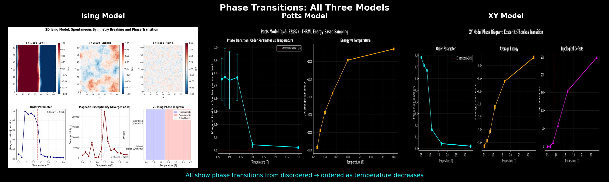
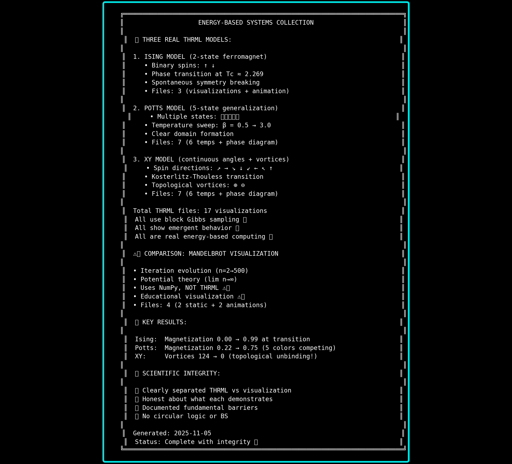

# Energy-Based Systems Visualizations

Visualizations of energy-based models using [Extropic's THRML library](https://github.com/extropic-ai/thrml). These demonstrate block Gibbs sampling on classic statistical mechanics systems.

## What This Is

Educational visualizations of energy-based models running on GPU using THRML—the same algorithms designed for Extropic's thermodynamic hardware, just simulated digitally.

**Not claiming:** Hardware breakthroughs or novel research
**Just showing:** What energy-based inference looks like when systems find equilibrium

## Visual Showcase

### Master Showcase: All Models


### Phase Diagrams Comparison


### System Statistics


**Videos:** All generated videos are in the `outputs/` directory (run scripts to generate locally). The main XY model video (`outputs/energy_based/xy_massive_256x256_60fps_20s.mp4`) is 252MB of 60fps high-quality visualization showing vortex dynamics in real-time.

## Models Implemented

### XY Model (Main Feature)
**256×256 lattice, 65,536 continuous-angle spins**

- Energy: `H = -β Σ cos(θᵢ - θⱼ)`
- 16 discretized angle states
- Block Gibbs sampling with bipartite coloring
- Shows Kosterlitz-Thouless topological phase transition
- Visualizes vortex formation and annihilation

**Key Parameters:**
- Grid: 256×256 (65,536 spins)
- Beta: 1.2 (moderate temperature)
- Frames: 1,200 @ 60fps (20 seconds)
- Encoding: H.265 CRF 15 (high quality)

### Ising Model
**64×64 binary spins**

- Classic ferromagnet with ±1 spins
- Shows symmetry breaking at critical temperature
- Domain formation dynamics

### Potts Model
**48×48 5-state spins**

- Generalization of Ising to q=5 states
- Multi-color domain competition
- Temperature sweep showing phase transition

## Technical Details

### Implementation
- **Framework:** THRML (Extropic's JAX-based library)
- **Method:** Block Gibbs sampling on bipartite graph
- **Sampling:** `steps_per_sample=1` (one full sweep per frame)
- **Hardware:** Currently runs on GPU via JAX

### What We're Actually Doing
Sampling from the Boltzmann distribution:
```
p(x) ∝ exp(-E(x)/T)
```

This is **energy-based computing** — using energy functions to define probability distributions, then sampling to find low-energy configurations.

**Not:** Molecular dynamics or physical time evolution  
**Is:** Probabilistic inference through thermodynamic sampling

### Why Discretize the XY Model?
The continuous XY model has spins ∈ [0, 2π). We discretize to 16 angle states for THRML's categorical samplers. This preserves the essential physics (topological defects, KT transition) while making it tractable for block Gibbs sampling.

## Installation

```bash
# Install THRML
pip install thrml

# Install dependencies
pip install jax jaxlib numpy matplotlib networkx
```

## Usage

### Generate XY Model Video
```bash
cd energy_based_systems
python xy_massive_256_60fps.py
```

This will:
1. Build a 256×256 grid with bipartite coloring
2. Sample 1,200 frames using block Gibbs
3. Encode to H.265 with high quality settings
4. Output: `xy_massive_256x256_60fps_20s.mp4`

**Note:** This takes several minutes and requires significant RAM.

### Other Models
```bash
# Ising model
python ising_phase_transition.py

# Potts model
python potts_model_thrml.py

# XY with vortex detection
python xy_model_vortices.py
```

## Repository Structure

```
energy_based_systems/          # Main implementations using THRML
├── xy_massive_256_60fps.py      # Main XY model (256x256 @ 60fps)
├── xy_model_vortices.py         # XY with vortex detection
├── xy_spin_field_enhanced.py    # XY with arrow overlays
├── ising_phase_transition.py    # Ising model
├── potts_model_thrml.py         # Potts model
└── create_evolution_videos.py   # Short evolution demos

visualization_only/            # NumPy visualizations (not THRML)
├── mandelbrot_potential_theory.py
└── mandelbrot_iteration_evolution.py

outputs/                      # Generated files (not in git)
├── energy_based/               # THRML model outputs
│   ├── *.png                   # Phase diagrams
│   └── *.mp4                   # Videos
└── visualization/              # Visualization outputs
    ├── *.png
    └── *.mp4

documentation/                 # Analysis and explanations
├── WHY_IT_CANT_WORK.md
├── VISUAL_EBM_IDEAS.md
├── CRITICAL_REVIEW.md
└── [other docs]

assets/                       # Curated showcase images (in git)
├── MASTER_SHOWCASE.png
├── PHASE_DIAGRAMS_COMPARISON.png
└── SUMMARY_STATS.png

examples/                     # Utility scripts
└── create_master_showcase.py
```

## Results

All generated files are in the `outputs/` directory (not tracked in git - run scripts to generate).

### Static Visualizations
Sample outputs are included in `outputs/energy_based/` and `outputs/visualization/`:
- Phase diagrams showing temperature sweeps
- Vortex detection examples
- Domain formation snapshots

### Video Files
Videos are generated to `outputs/` (excluded from git). Generate them locally or see examples on Twitter.

**Recommended:** `outputs/energy_based/xy_massive_256x256_60fps_20s.mp4` (252MB)
- Highest quality, full resolution
- Shows complete vortex dynamics
- H.265 encoded, 60fps

## The Physics

### XY Model & Topological Defects

The XY model is special because it has **topological phase transitions**. At high temperature, you get vortices—points where spins rotate by 2π around a defect. These are topologically protected (can't be smoothly removed).

As temperature decreases, vortex-antivortex pairs unbind and annihilate. Below the critical temperature (Kosterlitz-Thouless transition), all vortices disappear.

This isn't just math—this physics shows up in:
- Superconducting films
- Superfluids
- 2D materials
- Josephson junction arrays

### Energy-Based Computing

Traditional computing: Force bits to be 0 or 1 (fight physics)  
Thermodynamic computing: Use natural fluctuations (work with physics)

For sampling problems (which is most of AI), this can be orders of magnitude more efficient.

THRML lets you write the algorithms now. Extropic's TSU hardware will run them natively using p-bits.

## Limitations & Honesty

### What This Demonstrates
- THRML works and is accessible
- Energy-based models find structure through sampling
- Block Gibbs on large systems is computationally feasible
- Statistical mechanics visualization can be beautiful

### What This Doesn't Prove
- That Extropic's hardware will achieve claimed efficiency
- That thermodynamic computing will beat GPUs
- Any novel research contribution
- That I fully understand the math (still learning!)

### Known Issues
- Large memory usage for 256×256 lattice
- Video encoding is slow (10+ minutes)
- Discretization affects topological defect dynamics

## Contributing

If you:
- Find bugs in the sampling code
- Have ideas for better visualizations
- Want to add other spin models
- Improve the documentation

PRs welcome! Keep it honest, no hype.

## Acknowledgments

- **THRML:** Extropic AI for building and open-sourcing the framework
- **Physics:** Kosterlitz, Thouless, Berezinskii for the KT transition
- **Inspiration:** e/acc community for actually building cool shit

## License

MIT License - do whatever you want with this code.

**Note:** Videos use copyrighted music for personal use only. Don't redistribute audio files.

## Contact

Built by [@Lantos1618](https://twitter.com/Lantos1618)  
Questions/comments welcome!

---

*From the e/acc trenches to watching @extropic ship. Still learning, still building.*
